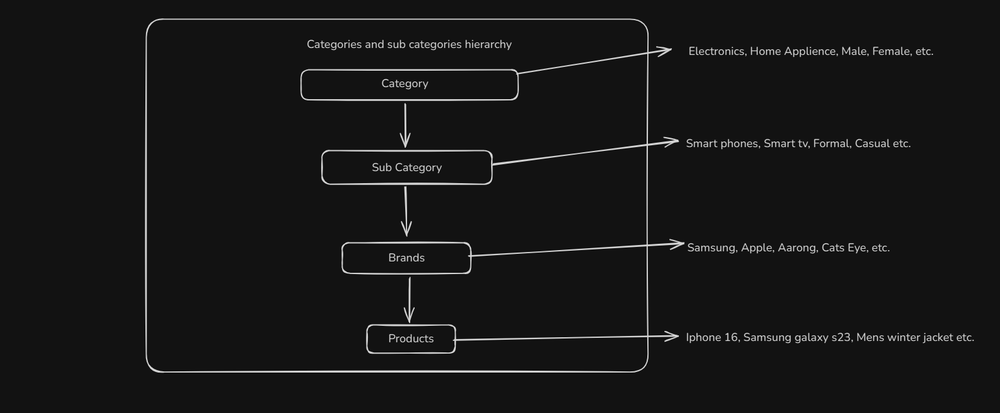

# 🛍️ Vendora | A Multi-Vendor E-Commerce Application

Vendora is a full-stack multi-vendor e-commerce application built with the MERN stack. It’s a feature-rich platform where multiple vendors can register and sell their own products. The application currently supports three main user roles:

- 🛠️ **Admin** (Upcoming Feature)
- 🛒 **Seller**
- 👤 **Customer**

Unauthenticated users can also browse certain public routes as guests.

> ⚠️ **Note:** This project is still under development. Many major features are currently in progress and will be fully functional very soon.

# 🧪 Demo Credentials

You can use the following demo accounts to explore the application:

| Role     | Email                | Password    |
| -------- | -------------------- | ----------- |
| Seller   | alexarnold@gmail.com | seller123   |
| Customer | johnmount@gmail.com  | customer123 |

> ⚠️ Note: These are test accounts with limited permissions. Please don’t modify sensitive data.

# ✨ Key Features

### 👥 User Roles

- 🔓 **Public:** Browse products, view categories
- 👤 **Customer:** Add to cart, checkout, view orders
- 🛒 **Seller:** Manage products, view orders, update listings
- 🛠️ **Admin:** (Upcoming) Review and approve products, manage users and vendors

### 🧩 Core Features

- 🔐 **Authentication** using JWT with role-based access control ✅
- 🛍️ **Product Management** for sellers ⌛
- 💳 **Cart & Checkout** system for customers ⌛
- ⚙️ **Admin Product Review** system ⌛
- 🗃️ **Category & Tag Filtering** ⌛
- 📦 **Order History** for both customers and sellers ⌛
- 🖼️ **Product Image Uploading** functionality ⌛
- 🔧 **More features coming soon** as the project evolves based on requirements and real-world use cases ⏳

# 🚀 Live Demo

- 🔗 **Live Site (Front-End):** [https://vendora-e-commerce.netlify.app](https://vendora-e-commerce.netlify.app)
- 🌐 **Live API (Backend):** [https://vendora-server.onrender.com](https://vendora-server.onrender.com)

### ⚠️ Note: Since I deployed the server on Render using the free trial, it may automatically go to sleep after a certain period of inactivity. I plan to fix this issue soon by upgrading to a premium plan. I kindly ask for your patience and understanding if the server takes a moment to wake up during testing. 🙏

---

### 📂 GitHub Repositories

- 💻 **Frontend:** [GitHub - Vendora Client](https://github.com/Shahriar090/Vendora-Client)
- 🛠️ **Backend:** [GitHub - Vendora Server](https://github.com/Shahriar090/vendora-server)

> 📝 **Note:** Both frontend and backend links are included to help evaluators and collaborators test the full application flow.

# 🛠️ Tech Stack

- 🟨 **Node.js** – JavaScript runtime for building scalable server-side applications
- 🧱 **Express.js** – Minimalist web framework for handling HTTP requests and APIs
- 📦 **MongoDB** – NoSQL database used with Mongoose for data modeling
- 🌿 **Mongoose** – Elegant MongoDB object modeling for Node.js
- 🔐 **JWT (jsonwebtoken)** – Secure token-based authentication for protected routes
- 🔑 **bcrypt** – Password hashing for authentication
- 📂 **cookie-parser** – Parse and manage cookies in requests
- 🌐 **CORS** – Cross-origin resource sharing setup for secure API access
- ⚙️ **Zod** – Runtime schema validation and type safety
- 🌫️ **dotenv** – Load environment variables from `.env` files
- 📡 **HTTP Status** – Utility for readable HTTP status codes

### 🧪 Development Tools & Code Quality

- 🛠️ **TypeScript** – Strongly typed superset of JavaScript
- 🔁 **ts-node-dev** – Hot reloading for faster local development
- 🧹 **ESLint** – Linter for consistent and error-free code
- 🎨 **Prettier** – Code formatter for consistent styling

# 📬 Environment Variables

To run this project, create a `.env` file in the root directory and define the following variables:

## Application Environment

NODE_ENV=development

PORT=5000

## Database

DB_URL=your_mongodb_connection_string

## Security

BCRYPT_SALT_ROUND=10

## JWT Tokens

ACCESS_TOKEN_SECRET=your_access_token_secret

ACCESS_TOKEN_EXPIRY=5m

REFRESH_TOKEN_SECRET=your_refresh_token_secret

REFRESH_TOKEN_EXPIRY=2d

## Cloudinary Configuration

CLOUDINARY_CLOUD_NAME=your_cloudinary_cloud_name

CLOUDINARY_API_KEY=your_clodinary_api_key

CLOUDINARY_API_SECRET=your_cloudinary_api_secret

> 📌 **Tip:** You can copy the structure from `.env.example` (if included) and replace sensitive values with your own.

📄 [View .env.example](./.env.example)

# 🚀 Getting Started

Follow these steps to set up the backend project locally:

### 🔃 Clone & Install

```bash
# Clone the repository
git clone https://github.com/Shahriar090/vendora-server.git

# Navigate into the project directory
cd vendora-server

# Install dependencies
npm install

# Start in development mode (with hot reload)
npm run start:dev

# OR start in production mode (after building)
npm run build
npm start

📌 Note: Make sure to create a .env file based on .env.example before running the server.
```

# 📂 Folder Structure

This is a high-level overview of the `vendora-server` directory structure:

Vendora Server (Root folder)

- dist => (Compiled JavaScript output (from TypeScript))

- src => (Main source code)

- app => (Core application logic)

- config => (Environment variable and app config management)

- errors => (Centralized error handling (cast, validation, etc.))

- globalInterface => (Global TypeScript interfaces and types)

- middleware => (Custom Express middleware functions)

- modules => ( Feature-based modules (auth, user, product, etc.))

- routes => (Route definitions and layout )

- utils => (Reusable utility/helper functions)

- app.ts => (Express app configuration)

- server => (Server entry point and initialization)

## 🔃 Product and Category Management

I have structured the categories and products in a tree-like hierarchy. This helps in organizing products efficiently under main categories and subcategories.

Below is a screenshot to give you a better understanding of the structure:

### 🖼️ Category and Product Structure



# 🔐 Authentication & Role-Based Access Control

- ✅ **JWT-based authentication** implemented using access tokens stored in **HTTP-only cookies** for enhanced security.
- ✅ **Role-based authorization** ensures protected routes are only accessible by users with appropriate roles (e.g., `customer`, `seller`, `admin`).
- ✅ **Auth middleware** verifies token validity and attaches user info to the request object.
- ✅ **Custom role guards** restrict access to specific endpoints (e.g., only sellers can create products, only admins can approve).

# 📦 Deployment

- 🟪 **Render** – Hosting the backend server and exposing RESTful API endpoints
- 🌐 **MongoDB Atlas** – Cloud-based database service for storing all application data
- 🔗 **Netlify** – (Frontend only) Hosts the React-based client application

> 📝 Note: Although Netlify is used for the frontend, it's listed here to show the full deployment flow.

# 📫 API Documentation

For a detailed list of all API endpoints, request/response formats, and user role access:

📄 **Google Docs API Reference**  
🔗 [View API Documentation](https://docs.google.com/document/d/1FnrmXydTpMw9hh8SpoEON5Hb4kLw561pdQLdCqcIRD4/edit?usp=sharing)

> This document includes routes for authentication, product management, order handling, and role-based access control.

📌 **Note:** As the application is still under development, more API endpoints will be added soon.

# 🧑‍💻 Author

### Mohammad Shahriar Hossain

#### MERN Stack Developer

#### 📧shahriarh655@gmail.com

#### 🌐 Portfolio | LinkedIn | GitHub

- 🔗 [Portfolio](https://dev-shahriar.netlify.app/)
- 🔗 [LinkedIn](https://www.linkedin.com/in/shahriarhsn/)
- 🔗 [GitHub](https://github.com/Shahriar090)

## 🙏 Acknowledgements

I am truly grateful to **FourBTech** for shortlisting me and giving me the opportunity to prove myself. I understand that there’s still work needed to make this application fully complete, but I’m confident in my ability to implement all the remaining features — it’s only a matter of time.

Due to some personal and family matters, I couldn’t give 100% within the deadline. I know that in professional settings, missing a deadline is rarely excusable, and I take full responsibility for that.

That said, as mentioned in the task description — _"This is not just a coding assignment — it is a test of your problem-solving, decision-making, and communication skills under real-world development constraints."_ — I have tried my best to demonstrate all of these qualities through my work and approach.

In one of my earlier e-commerce projects, **[Gearly Server](https://github.com/Shahriar090/Gearly-Server)**, I successfully implemented features such as:

- Product listing by admin
- Add to cart & checkout functionality
- Payment integration using SSLCommerz

While I couldn't integrate all these features into this evaluation task due to time constraints, I genuinely enjoyed working on it and appreciated the learning experience.

Thank you once again for the opportunity. I look forward to any feedback you may have and would be honored to contribute to this project or other exciting opportunities in the future.
